# frontend

## Index page

## Login page

## Reset password page
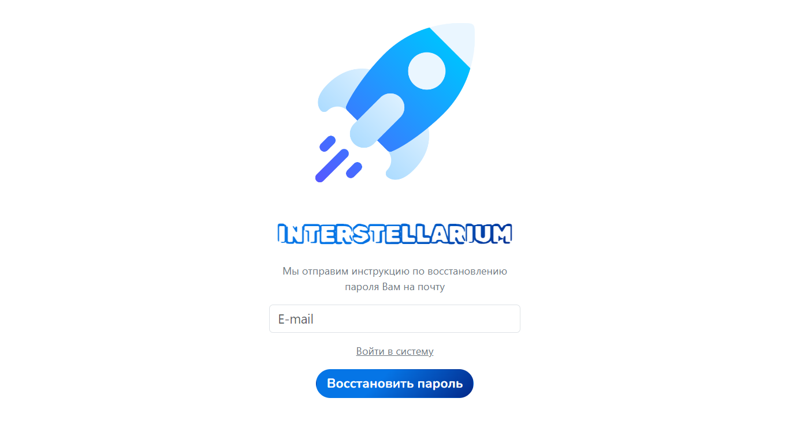
## Dashboard page
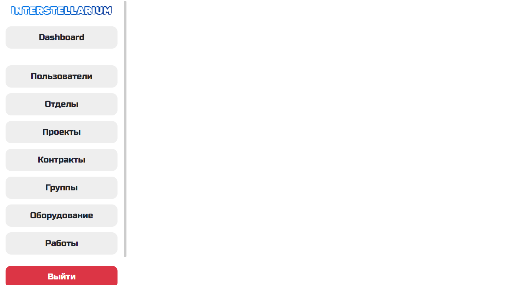

## Users page
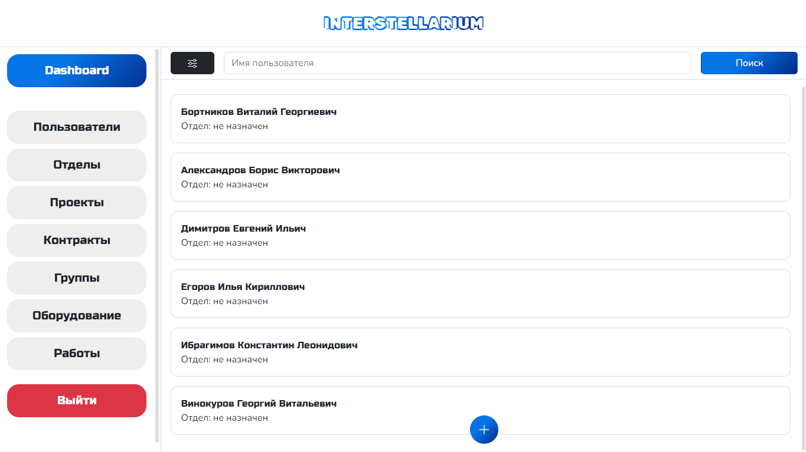
## Create User page
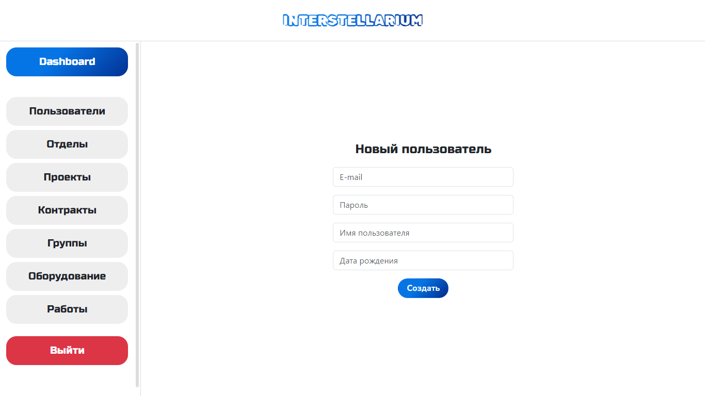

## Groups page
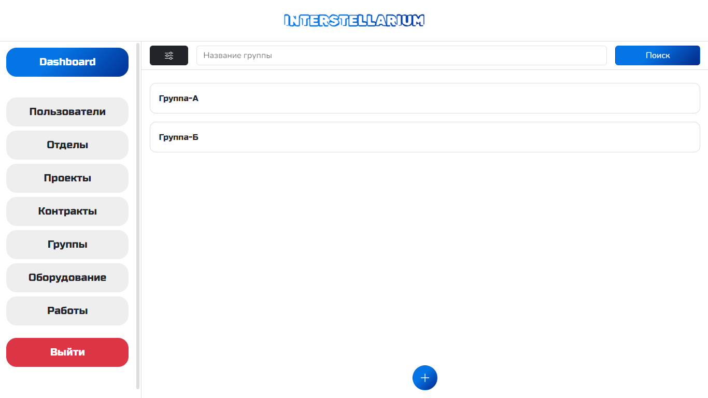
## Create Group page
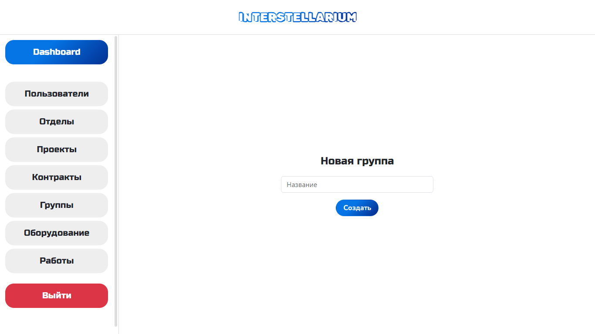

## Works page
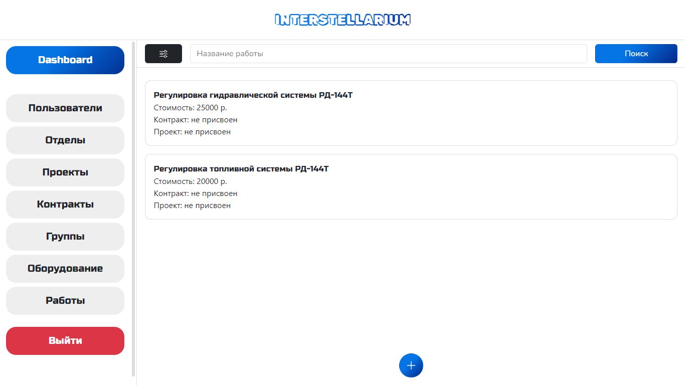
## Create Work page
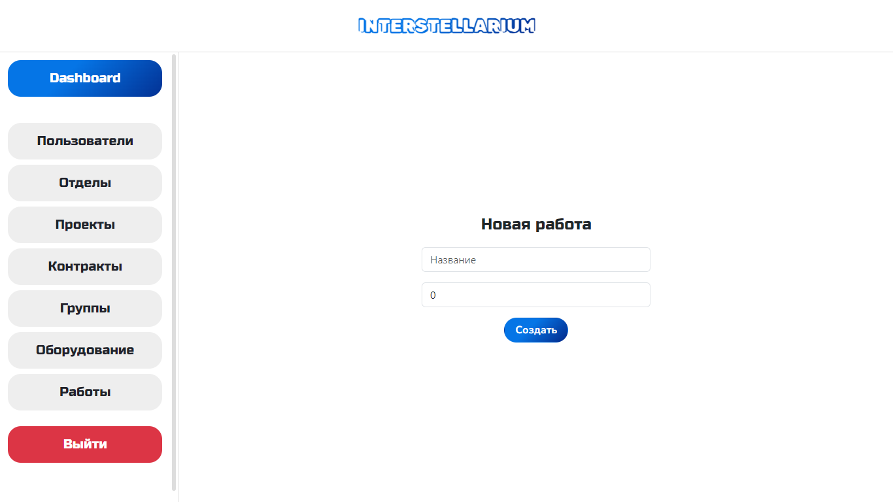

## Equipment page
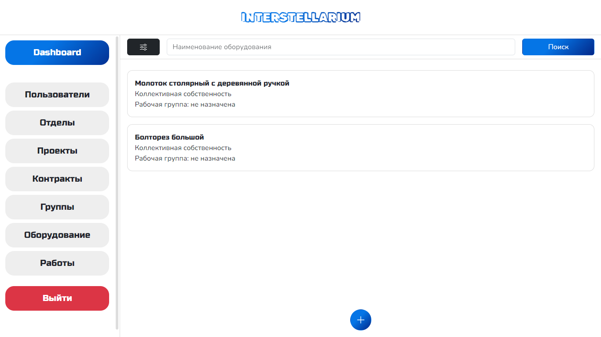
## Create Equipment page

## Departments page
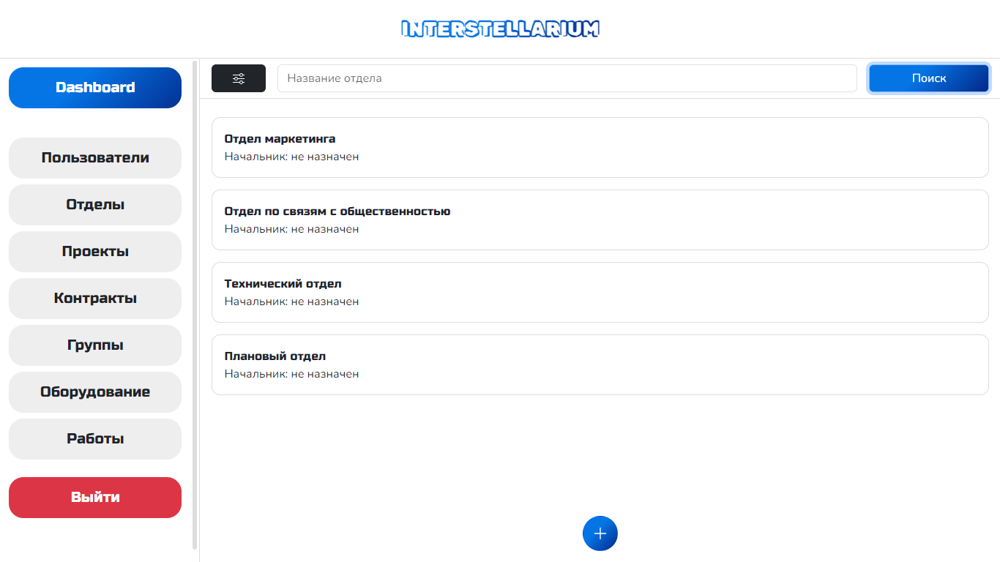
## Create Department page
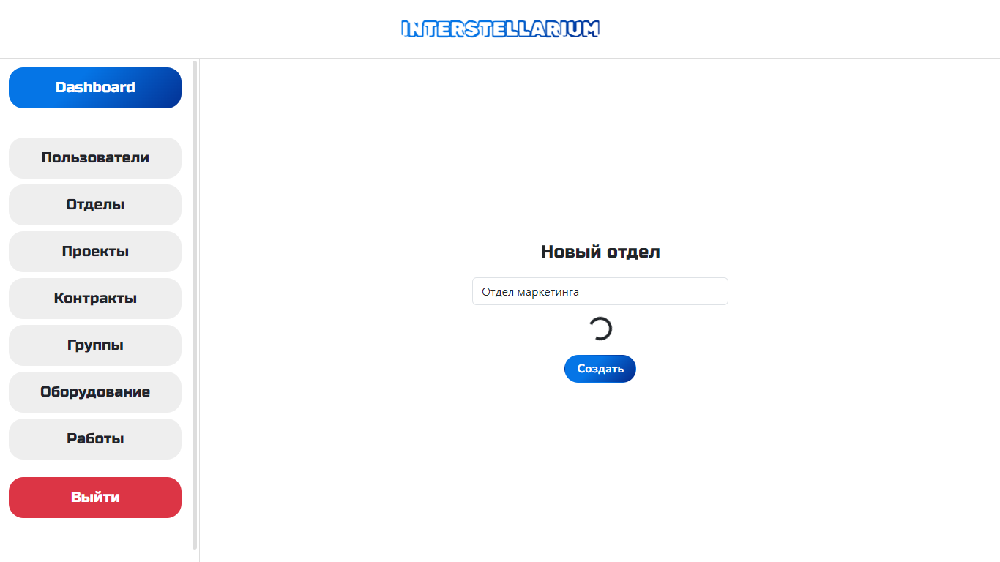
## Department Profile page
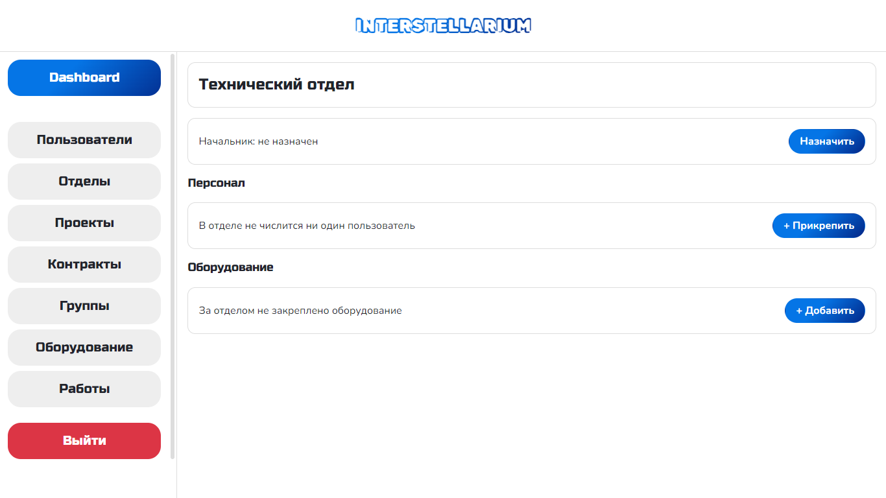

## Projects page
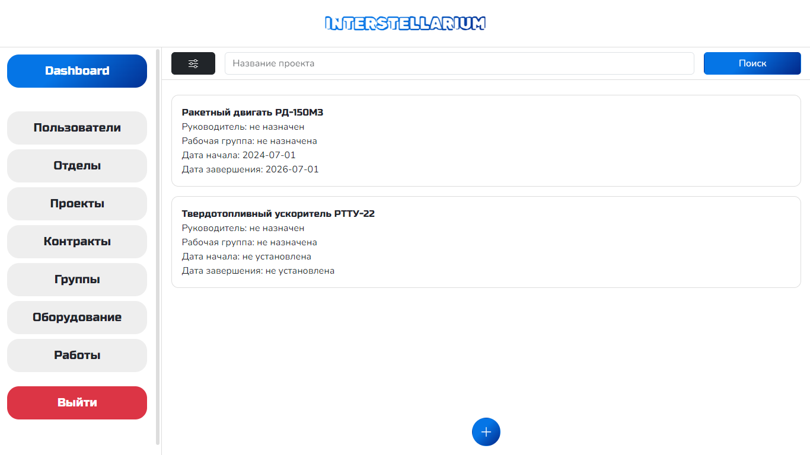
## Create Project page
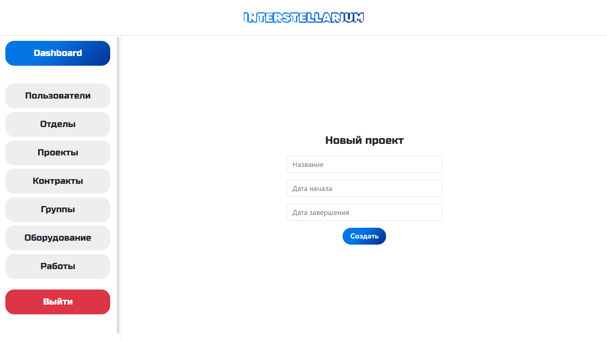
## Project Profile page
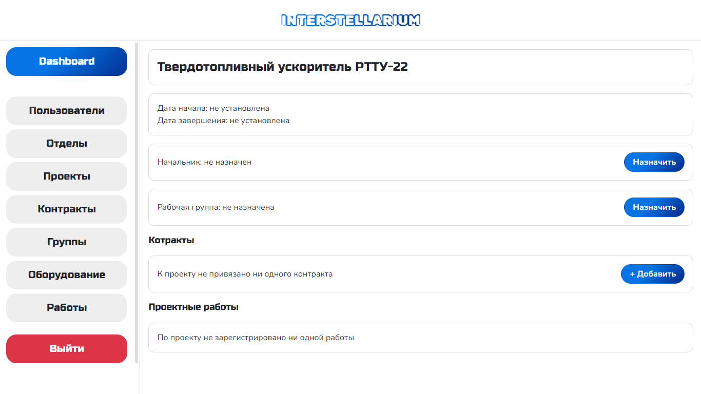

## Contracts page
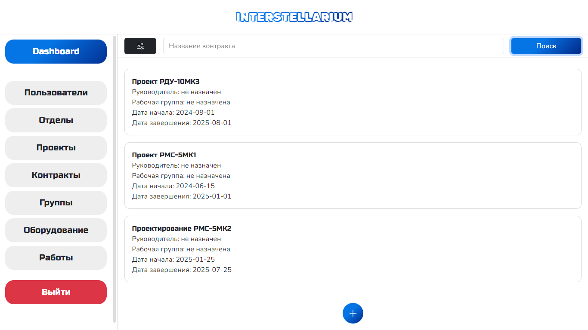
## Create Contract page
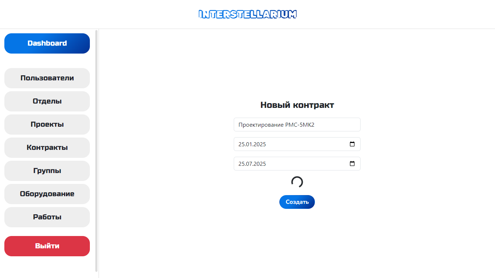
## Contract Profile page
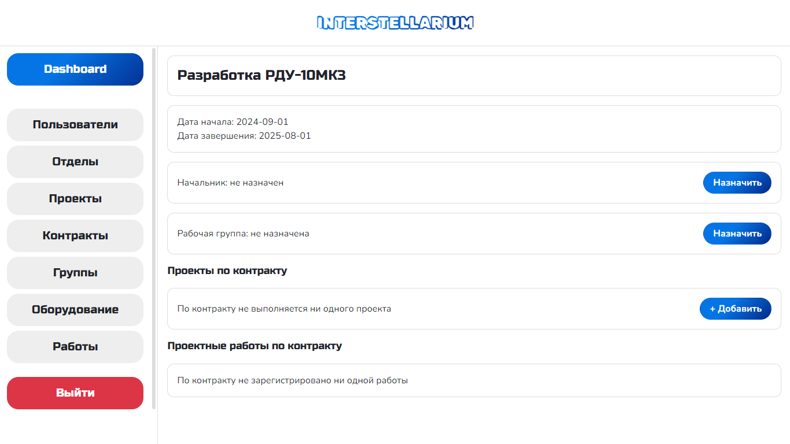
