# Interstellarium Frontend
# Mobile views

  
  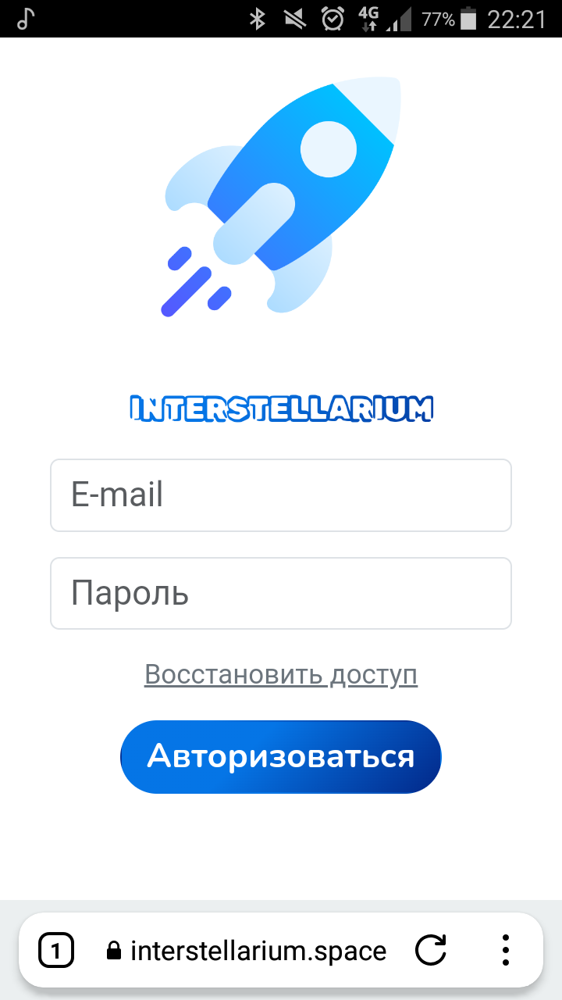 
  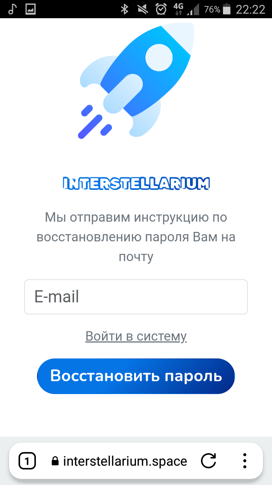

  
   
  

  
   
  

  
   
  

  
   
  

  
   
  

  
   
  

  
   
  

  
   
  

# Desktop views
## Index page

## Login page

## Reset password page

## Dashboard page

## Users page
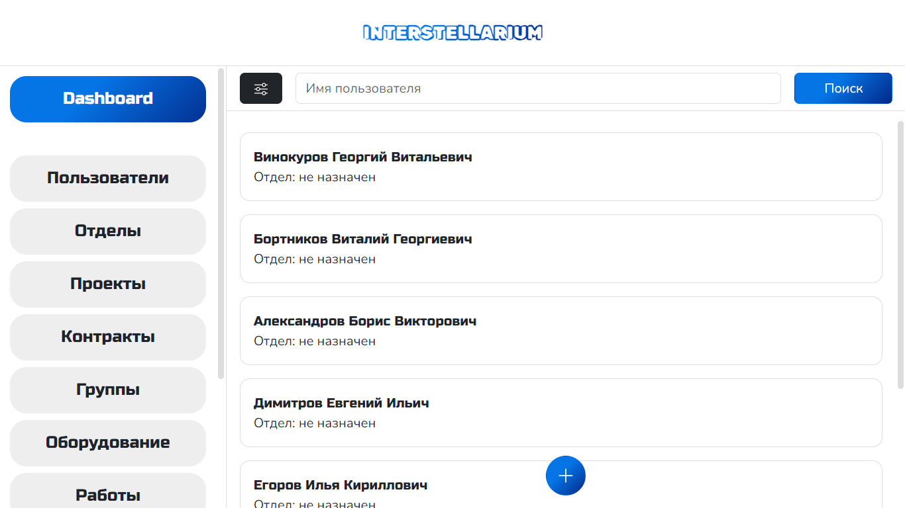
## Create User page
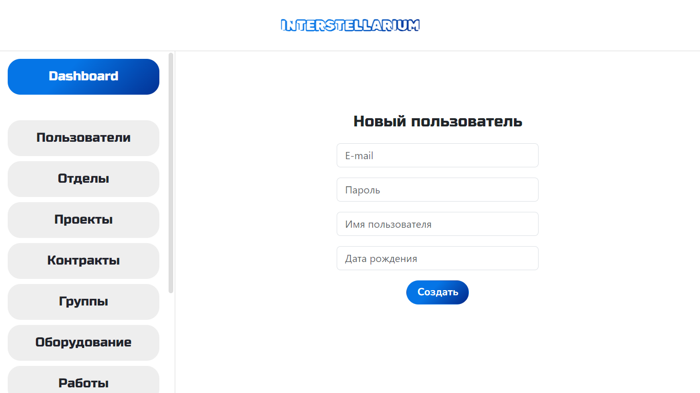
## User Profile page

## Select User

## Groups page
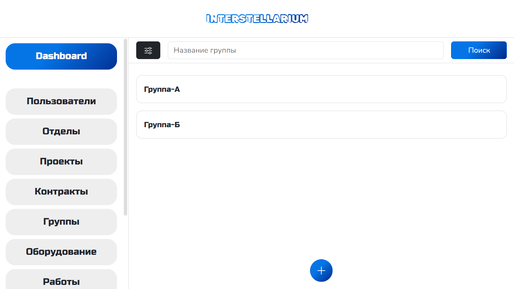
## Create Group page

## Group Profile page

## Select Group

## Works page

## Create Work page

## Work Profile page

## Select Work

## Equipment page

## Create Equipment page

## Equipment Profile page

## Select Equipment

## Departments page

## Create Department page

## Department Profile page
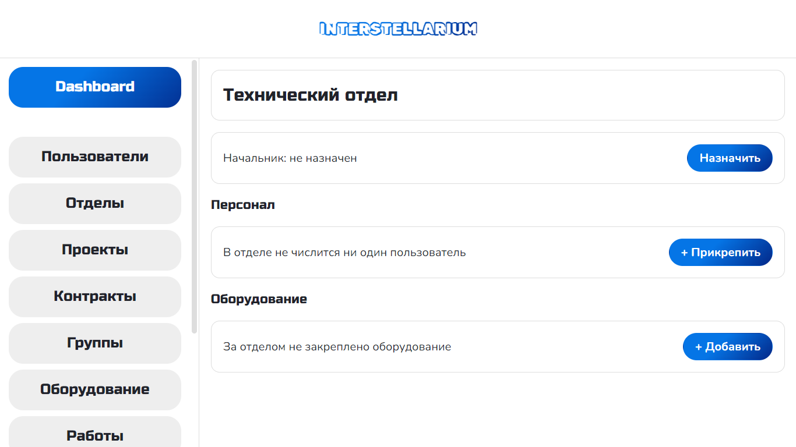
## Select Department

## Projects page
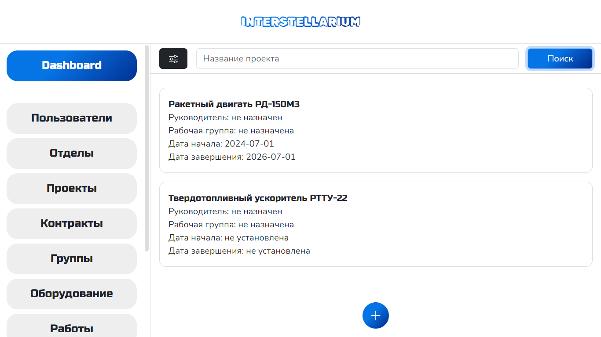
## Create Project page

## Project Profile page
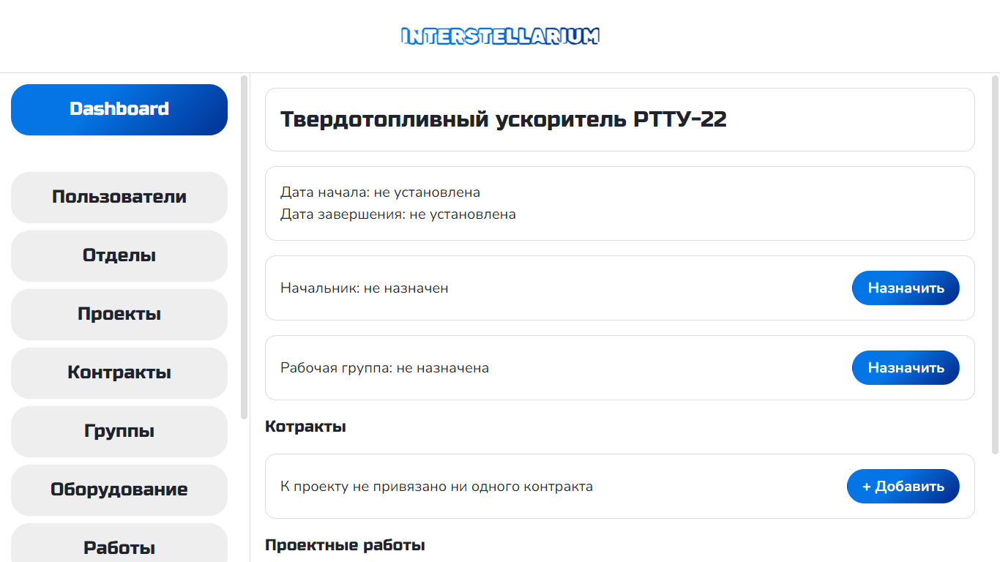
## Select Project
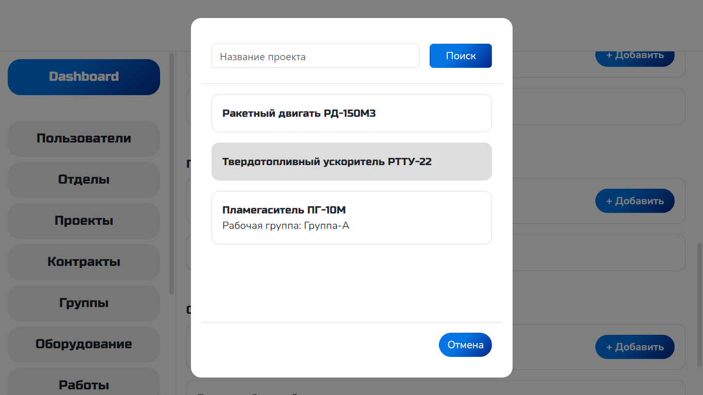

## Contracts page

## Create Contract page

## Contract Profile page
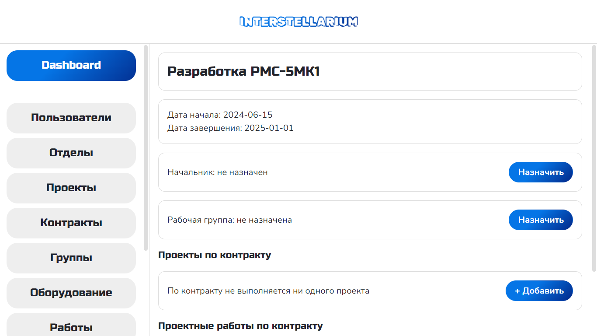
## Select Contract
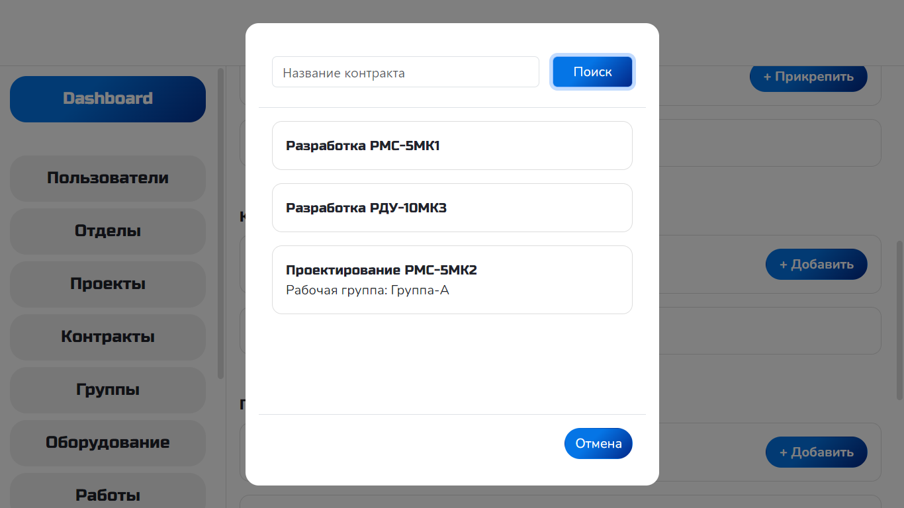
